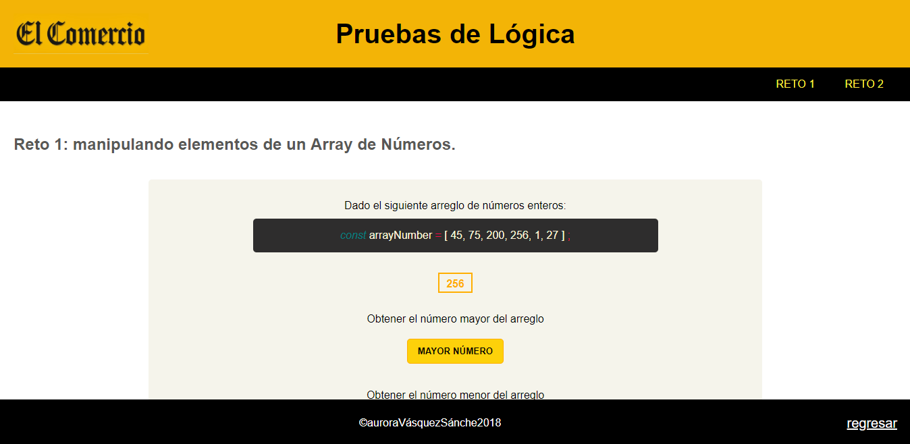
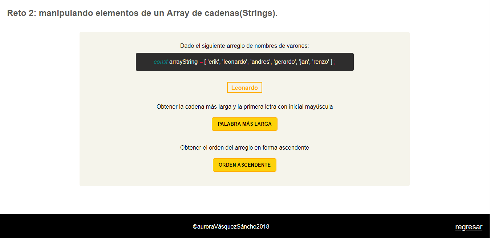
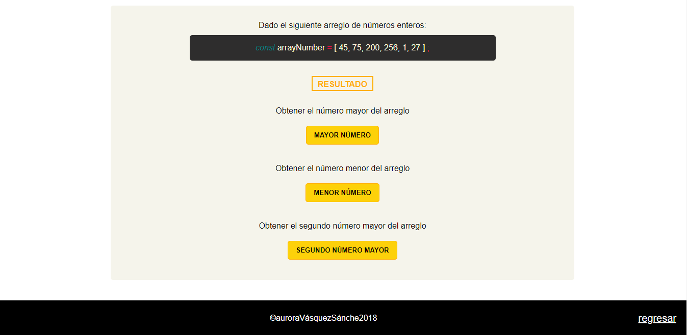

# Reto El Comercio

### El proyecto consiste en resolver dos ejercicios de lógica propuestos por la empresa El Comercio utilizando el lenguaje de programación Javascript.

### El primer ejercicio(arreglo de números) nos pide mostrar el número mayor, el número menor y el segundo número mayor del arreglo preestablecido.

### En el segundo ejercicio(arreglo de cadenas) se debe mostrar la cadena(string) más larga del arreglo y que este se muestre con la primera letra en mayúscula, y por último, se debe ordenar de forma ascendente(a-z) cada elemento del arreglo y mostrar el nuevo arreglo generado.

### Para resolver dichos ejercicios se consideraró No aplicar ningún framework, libreria y/o métodos nativos de javascript, a excepción de length.

;

;

;

## Desarrollado para 
[El Comercio](https://elcomercio.pe/);

